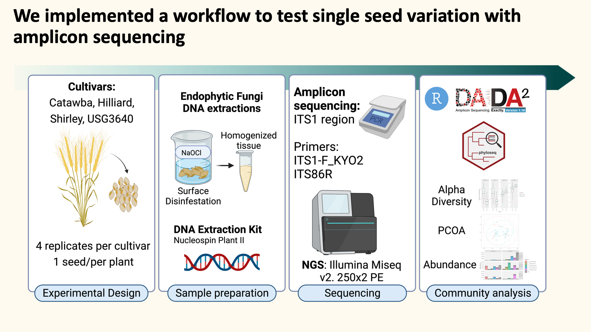

## Why the seed mycobiome?			

Wheat is an essential component of the global diet, providing roughly a fifth of the
world\'s available calories and protein. In 2021 wheat farmers in the United States experienced
record heatwaves and droughts, leading to a 10% decline in yields. Plant associated microbes
implicated in aiding plant adaptation to abiotic and biotic stressors show promise as a mechanism
to improve crop resilience in a changing environment. While much work has been done to
examine the microbes associated with roots and leaves, less is known about seed associated
microbes and their functional roles. As a flowering plant undergoes reproduction, pathogenic and
non-pathogenic fungi attempt to colonize the developing seed niche in waves of introductions
from other plant organs and the surrounding environment.

However, the barriers of entry to the seed interior present numerous obstructions for fungi including physical and immunological barriers. Fungi present in the environment must bypass floral barriers, navigate beyond the seed coat, and avoid activating the immune system, as well as adapt to a rapidly changing environment as the seed matures. These barriers result in a small cohort of active seed fungal endophytes living within seed tissue. My dissertation research focuses on characterizing the mycobiome composition of the wheat seed and understanding the factors that influence wheat seed mycobiome composition and structure.

------------------------------------------------------------------------

### Genotype

I began with an effort to isolate and characterize endophytic fungal taxa from seeds of 4 winter wheat cultivars commonly grown in the southeastern United States. The isolation methods utilized involved seed fragmentation, size selection, and dilution for optimal density of unique cultures in nutrient media, which yielded 21 unique taxa spanning 12 genera.

To complement our isolation efforts, we implemented a culture independent method to metabarcode fungal taxa associated with wheat seeds, which yielded 78 taxa, representing 31 genera.

This dual approach allowed us to establish a valuable isolate collection of fungal taxa regionally associated with wheat seeds and evaluate our isolation methods to identify areas of improvement for future isolation studies.

------------------------------------------------------------------------

### Geography

Seed associated fungal communities are generally characterized as robust and relatively
stable compared to their bacterial counterpart. To obtain a better understanding of what factors
structure the wheat seed mycobiome, I was curious as to whether biotic and environmental
factors such as host genotype, geography, field season, and drought stress exert measurable
influence. I explore some of these factors by growing two winter wheat cultivars in
Official Variety Trials across the state of North Carolina. These trials allow for examination of
how the wheat seed mycobiome changes in response to regional geography, genotype, and field
season.

In Chapter 4, I exposed three winter wheat cultivars to post-flowering drought in a
multigenerational study, with the aim of understanding how drought stress influences the wheat
seed mycobiome, and what legacy effects may occur in the following generation. We discovered
that the wheat seed mycobiome is largely resilient in the face of geographic variation, genotypic
pedigree, and drought stress. Overall, this dissertation provides 1) Insight into the composition
and structure of winter wheat regionally adapted to the southeastern United States and 2)
Increased our understanding of how drought stress decreases species richness but does not
perturb the wheat seed mycobiome structure.

				

			

		

	

				

			

		

	
