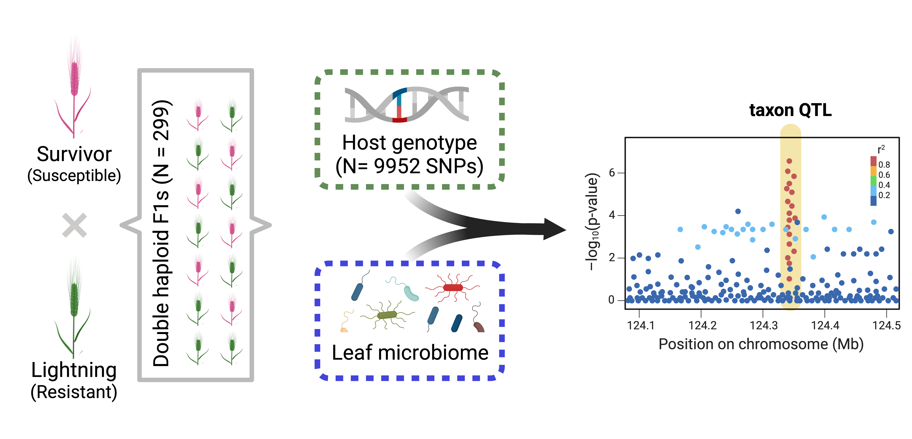

### This is a project that I was invited to collaborate on with Patrick Hayes (Barley breeder at Oregon State) and Posy Busby. We are using Quantitative trait locus (QTL) mapping to identify barley genomic regions associated with variations in fungal taxa.

------------------------------------------------------------------------

Malting barley is a critical component of fermented beverages produced globally. Barley scald, a fungal disease with global presence that can cause up to 30% yield loss for growers. While minor host resistance genes have been identified, much less is known about how fungal communities are correlated with resistance to barley scald.

Here, we are characterizing the barley leaf fungal communities and performing quantitative trait locus (QTL) analysis to identify host genetic loci associated with abundant fungal taxa. We are integrating microbiome QTL (mbQTL) to uncover microbiome–disease associations and identify candidate leaf fungal taxa associated with barley scald resistance.

------------------------------------------------------------------------
