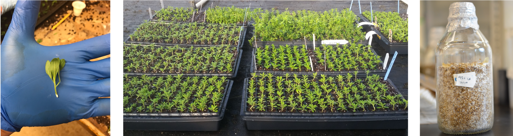
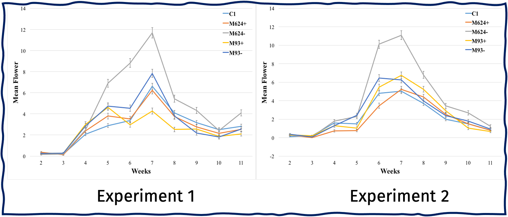

### In this project, I had the opportunity to work with a plant-fungal system and answer questions as to how soil fungi can influence host plant reproduction. This research provides the basis for our interest in *Mortierella elongata* association and benefits to plants.

------------------------------------------------------------------------

### Why?

The fungus *Mortierella elongata* is commonly known as a decayer of
organic matter, or saprophyte, that is dispersed globally in temperate
climates. Recently, *Mortierella elongata* was isolated from roots
of *Populus deltoides* (eastern cottonwood) and associated soil. While
the fungus was recovered from the root interior, its role within the
soil associated with roots (rhizosphere) is not known. Previous research
examining plant growth promotion by *M. elongata* observed increased
plant height in a variety of plants, including tomato and corn grown in
field soil. This research provides the basis for our interest in *M.
elongata* association and benefits to plants. 

------------------------------------------------------------------------

We evaluated the effect of *M. elongata* on a solanaceous ornamental
plant, Calibrachoa. Our results suggest novel effects of increased
flowering abundance of plants amended with the fungus in a low nutrient
environment. 

