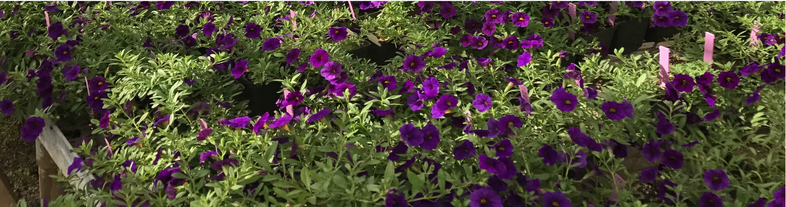
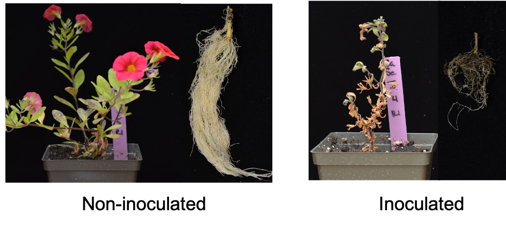

### Susceptibility of Calibrachoa cultivars to *Thielaviopsis basicola*, causal agent of black root rot disease. Here I screened seven elite Calibrachoa cultivars for their response to *T. basicola* inoculations in greenhouse.

------------------------------------------------------------------------

Calibrachoa is an annual flowering solanaceous groundcover plant, closely related to Petunia, introduced by breeders in 1990s. Production is currently valued at 45 million dollars annually in the US, and close to 1 million dollars in NC. Grown from cuttings in late fall/winter for sale in spring

------------------------------------------------------------------------

*Thielaviopsis basicola* Berk. and Broome (sp. nov. *Berkelyomyces basicola*), causal agent of Black Root Rot disease. Cosmopolitan soil-borne fungus, distributed throughout temperate areas. Capable of infecting over 15 families of plants, including solanaceae (nightshade family). Sanitation is key to management.

